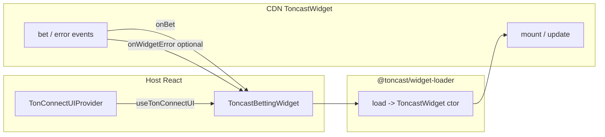

# Reference: Toncast widget (Option B) in a host app

This document complements the [README](README.md). It describes **what to copy into production** versus **what is demo-only** in this workspace, and how data flows between TonConnect, the loader, and the widget.

## Minimal production embed vs this demo

| Concern | Minimal production pattern | This repo (demo) |
|--------|----------------------------|------------------|
| TonConnect | One `TonConnectUIProvider` above any `useTonConnectUI` consumer | Same |
| Manifest | HTTPS URL or blob with `url` matching page origin | Same + footer hints |
| Loader | `ToncastWidgetLoader.load(cdnUrl?)` then `new Widget(config)` | Same + alias to monorepo source in `vite.config.ts` |
| Lifecycle | Prefer `dispose()` when discarding the instance (see below) | Same |
| Layout CSS | Your own flex/grid around the mount node | `host-widget-surface` wrapper in `App.tsx` |
| Theming | `widget.theme`, optional `widget.cssVars` from your design tokens | `widgetEmbedChrome.ts` + `--tc-widget-palette-*` in CSS |
| SDK client | Pass `client: { type: 'integrated', instance }` when you own a `ToncastClient` | Not wired — widget uses its default client unless you extend config |

## Lifecycle: `dispose()` vs `unmount()`

[`ToncastWidgetInstance`](../../packages/widget-loader/src/index.ts) exposes both:

- **`unmount()`** — removes the widget from the DOM.
- **`dispose()`** — unmounts if needed **and** clears all `on()` listeners. After `dispose()`, the instance must not be used again.

For a React effect cleanup when the component unmounts or when `tonconnect` / `cdnUrl` forces a full reload, **`dispose()`** is the safer default so `bet` / `error` bridges do not leak.

This demo app also exposes **`ToncastBettingWidgetHandle`** (`ref` on [`ToncastBettingWidget`](src/ToncastBettingWidget.tsx)) and a **Lifecycle demo** strip in the widget panel footer so you can call `unmount()` / `dispose()` from the UI and compare with **Remount** (`key++`).

## Event and error surfaces



- **`bet`** — business payload; forward to analytics or host state.
- **`error`** — thrown value from a **user-registered** listener on `mount` / `unmount` / `bet` only (see `ToncastWidgetEventMap` in the loader). It is **not** a general-purpose SDK error channel.
- **`widget.onRenderError`** — React render errors inside the widget boundary; log or ship to observability.

For **`ToncastError` / `ToncastApiError` / `ToncastWsError`** from `@toncast/sdk` when you use an integrated client, follow [AGENTS.md](../../AGENTS.md): do not swallow; surface or classify in your UI.

## CSS palette bridge

Canonical colors for the embed live on `:root` as `--tc-widget-palette-dark-*` and `--tc-widget-palette-light-*` in [`src/styles/host-tokens.css`](src/styles/host-tokens.css). [`readToncastWidgetCssVarsFromDocument`](src/widgetEmbedChrome.ts) reads them into `widget.cssVars`. If any token is missing (misconfigured host), built-in fallbacks apply and **dev** logs a warning.

## Optional: integrated `ToncastClient`

When your app already constructs `ToncastClient` (same session as the rest of the app), extend `ToncastWidgetConfig`:

```ts
client: { type: "integrated", instance: toncastClient },
```

Keep versions aligned with `@toncast/widget` / `@toncast/sdk` per monorepo releases.
